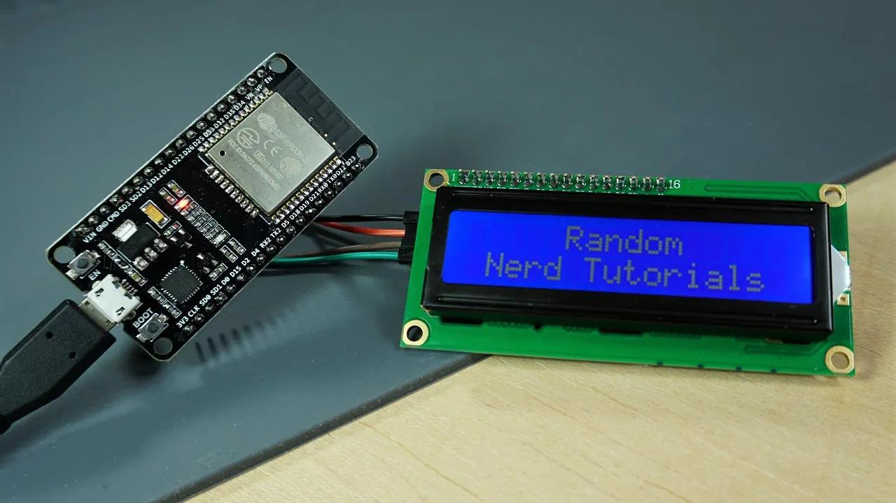

# 📡 4G Coverage Monitor via Modbus IP (ESP8266 / ESP32 + LCD 16x2)

Real-time diagnostic and monitoring system designed for mobile radio repeaters and field service vehicles. The microcontroller connects via **Wi-Fi** to an industrial 4G router (e.g., Teltonika RUT240) and issues periodic requests using the **Modbus IP (TCP)** protocol to retrieve signal metrics and SIM status, displaying them on an **LCD 16x2 I2C** screen.

---

## 📸 Hardware Setup

---

## 🎯 Use Case

During field operations and mobile radio repeater maintenance, checking cellular signal quality typically requires logging into the router's web interface. This portable device resolves that constraint by delivering immediate signal strength readings in **dBm** alongside visual diagnostic alerts for read failures, missing SIM cards, or loss of network connectivity.

---

## 🛠️ System Architecture & Components

- **Microcontroller:** ESP8266 / ESP32 (Dual support via conditional compilation).
- **Display:** LCD 16x2 with **I2C PCF8574** backpack (Address `0x27`).
- **Connectivity:** Local Wi-Fi connected to the 4G industrial router.
- **Communication Protocol:** Modbus IP (TCP) over standard port.

---

## 🚀 Firmware Features

- **Modbus TCP Read Operations:** Holding Register (*Hreg*) queries for 4G signal level in dBm (Offset `4`) and SIM/IMSI status identifier (Offset `348`).
- **On-Screen Diagnostics & Alerts:**
  - Startup sequence and Wi-Fi connection status control.
  - Missing SIM card detection alert (`Fallo SIM` / `SIM Error`).
  - Router responsiveness loss alert.
  - Real-time signal classification (**HIGH**, **MEDIUM**, **LOW**, **POOR**).
  - Visual prompts encouraging vehicle/antenna repositioning if signal degrades below critical thresholds (`<-92 dBm`).

---

## 📋 Hardware Pinout (I2C)

| LCD Display (I2C) | Microcontroller Pin |
| :--- | :--- |
| **VCC** | 5V / 3.3V |
| **GND** | GND |
| **SDA** | GPIO 13 |
| **SCL** | GPIO 14 |

---

## 💻 Required Libraries

- `LiquidCrystal_I2C.h`
- `ModbusIP_ESP8266.h`
- `ESP8266WiFi.h` / `WiFi.h`
- `Wire.h`

---

## 📝 Sanitization Notice

*The source code provided in this repository has been sanitized. Network identifiers (SSIDs) and Wi-Fi passphrases have been replaced with generic placeholders for security and confidentiality compliance.*
